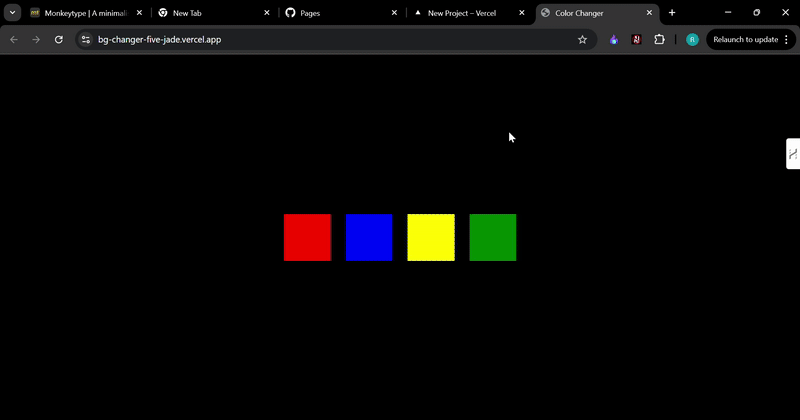

# BMI Calculator  

A simple and responsive **BMI Calculator** that calculates **Body Mass Index (BMI)** based on user input (weight in kg and height in cm).  

## 🚀 Features  

- 🏋️‍♂️ **BMI Calculation**: Calculates BMI using the formula:  
BMI = weight (kg) / (height (m) * height (m))

- 📏 **Takes Input in Metric System**: Weight in kilograms (kg) and height in centimeters (cm).  
- 🎨 **User-Friendly UI**: Simple and responsive interface using HTML, CSS, and JavaScript.  
- ⚡ **Instant Results**: Displays BMI category (Underweight, Normal, Overweight, Obese).  

## 🛠 Technologies Used  

- 🌐 **HTML** – Structure of the webpage  
- 🎨 **CSS** – Styling and layout  

## 📸 Demo  

  

